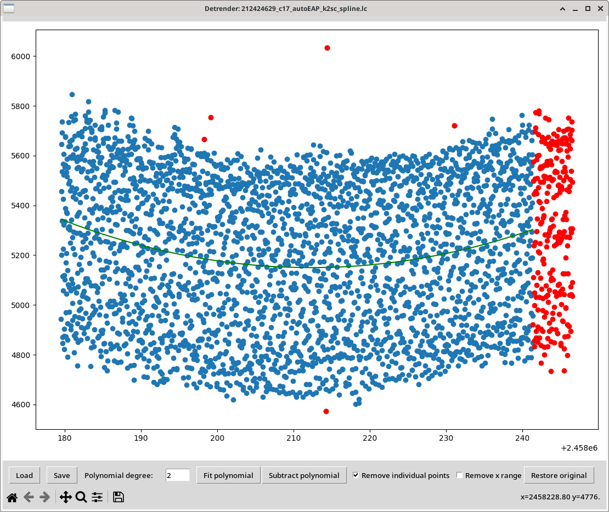

# Detrender
Detrender is a GUI program to prepare the time-series data for further analysis. It allows for visual inspection of the data, removal of outliers individually or larger parts of the data, and to remove trends by fitting and subtracting polynomials.

## Usage
Detrender can be started with
```
python detrender.py
```
Then the file can be loaded with the load button. Alternatively, the file can be loaded from command line with
```
python detrender.py file_name
```
Detrender can be used to:

- remove points individually by manually clicking on them
- remove parts of the data by marking the range of the x axis with bad data
- fit and subtract polynomials

Output files are saved when clicked at Save button. The output files are:

- data after modification applied by the user (_data)
- removed datapoints (_removed)
- coefficients of the fitted polynomial (_polynomial)

At any moment, the User can restore the data with the Restore button.

## Example
Removed points are marked with red. They are plotted for reference only and are not taken into account when e.g. fitting polynomial. Degree of the polynomial is indicated by the user and plotted with green line. Currently fitted polynomial can be subtracted from the data by clicking Subtract polynomial.



